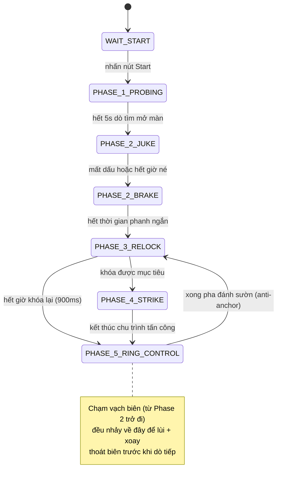

# Robot Sumo Tự Hành – ESP32 Firmware

Firmware điều khiển cho robot sumo tự hành (autonomous), chạy trên vi điều khiển ESP32. Sau khi bấm nút Start, robot hoạt động hoàn toàn tự động: dò tìm đối thủ bằng cảm biến khoảng cách, truy đuổi, tấn công đẩy, đồng thời tự né vạch biên trắng để không bị đẩy ra khỏi sân đấu.

## Mục lục
- [Tính năng chính](#tính-năng-chính)
- [Phần cứng yêu cầu](#phần-cứng-yêu-cầu)
- [Sơ đồ chân (Pinout)](#sơ-đồ-chân-pinout)
- [Thư viện cần cài đặt](#thư-viện-cần-cài-đặt)
- [Cấu hình trước khi nạp](#cấu-hình-trước-khi-nạp)
- [Nguyên lý hoạt động](#nguyên-lý-hoạt-động)
- [Nạp firmware & sử dụng](#nạp-firmware--sử-dụng)
- [Tinh chỉnh thông số](#tinh-chỉnh-thông-số)
- [Cấu trúc mã nguồn](#cấu-trúc-mã-nguồn)
- [Gỡ lỗi](#gỡ-lỗi-debug)
- [Giới hạn hiện tại](#giới-hạn-hiện-tại)

## Tính năng chính
- Máy trạng thái 7 pha mô phỏng chiến thuật thi đấu: chờ hiệu lệnh → dò tìm mở màn → né đòn đầu → khóa lại mục tiêu → tấn công → kiểm soát sân đấu
- Kết hợp cảm biến siêu âm HC-SR04 (bắt buộc) và ToF VL53L0X (tùy chọn, bật/tắt bằng một macro)
- Cơ chế **"anti-anchor"**: khi bị đối thủ ghì đứng yên, robot tự lùi ngắn rồi đánh vòng cung sang sườn thay vì cố đẩy thẳng mãi
- Tự động lùi + xoay né ngay khi cảm biến biên phát hiện vạch trắng ranh giới sân
- Ngẫu nhiên hóa chu kỳ quét siêu âm để giảm nhiễu chéo khi hai robot cùng dùng cảm biến siêu âm đối đầu nhau
- Debounce nút Start; log/telemetry chi tiết qua Serial để theo dõi và hiệu chỉnh

## Phần cứng yêu cầu
| Thành phần | Vai trò |
|---|---|
| Vi điều khiển ESP32 | Bắt buộc — dùng `esp_system.h` và API LEDC (`ledcAttach`/`ledcWrite`) |
| Cảm biến siêu âm HC-SR04 | Cảm biến khoảng cách chính để phát hiện đối thủ |
| Cảm biến ToF VL53L0X | Tùy chọn — cảm biến phụ tăng độ chính xác, bật qua macro `USE_VL53L0X` |
| Cảm biến vạch biên (ngõ ra số) | 1 cảm biến đặt chính giữa đầu robot, phát hiện vạch trắng ranh giới sân |
| Driver động cơ đôi kiểu TB6612FNG (hoặc tương đương) | Mỗi kênh gồm 1 chân PWM + 2 chân điều khiển chiều IN1/IN2 |
| 2 động cơ DC (bánh trái/phải) | Truyền động |
| Nút nhấn Start | Đấu `INPUT_PULLUP`, nhấn = mức LOW |

## Sơ đồ chân (Pinout)

| Chức năng | Hằng số | GPIO |
|---|---|---|
| Nút Start | `PIN_START_BUTTON` | 27 |
| Siêu âm – Trig | `PIN_US_TRIG` | 25 |
| Siêu âm – Echo | `PIN_US_ECHO` | 26 |
| ToF VL53L0X – SDA | `PIN_TOF_SDA` | 33 |
| ToF VL53L0X – SCL | `PIN_TOF_SCL` | 13 |
| Động cơ trái – PWM | `PIN_LEFT_PWM` | 18 |
| Động cơ trái – IN1 | `PIN_LEFT_IN1` | 21 |
| Động cơ trái – IN2 | `PIN_LEFT_IN2` | 19 |
| Động cơ phải – PWM | `PIN_RIGHT_PWM` | 5 |
| Động cơ phải – IN1 | `PIN_RIGHT_IN1` | 22 |
| Động cơ phải – IN2 | `PIN_RIGHT_IN2` | 23 |
| Cảm biến biên (giữa) | `PIN_EDGE_CENTER` | 32 |

> Cảm biến biên báo "phát hiện vạch trắng" ở mức `HIGH` (hằng số `EDGE_WHITE_LEVEL`). Nếu cảm biến của bạn xuất mức ngược lại, đổi hằng số này thành `LOW`.
>
> Nếu một bên động cơ quay ngược chiều mong muốn khi test thực tế, chỉnh `INVERT_LEFT_MOTOR` / `INVERT_RIGHT_MOTOR` thành `true` thay vì đấu lại dây động cơ.

## Thư viện cần cài đặt
- **Arduino-ESP32 core** (board package cho ESP32) — code tự nhận diện phiên bản core qua `ESP_ARDUINO_VERSION_MAJOR` để gọi đúng API LEDC (core v3+ dùng `ledcAttach`, core v2.x dùng `ledcSetup`/`ledcAttachPin`), nên tương thích cả hai dòng core phổ biến
- **Thư viện `VL53L0X`** (Pololu) — chỉ cần cài nếu bật cảm biến ToF

## Cấu hình trước khi nạp
Đầu file `Firmware.ino` có các macro/hằng số nên kiểm tra trước khi build:

```cpp
#define USE_VL53L0X 0   // đổi thành 1 nếu robot có gắn cảm biến ToF VL53L0X
```

```cpp
constexpr bool INVERT_LEFT_MOTOR  = false;
constexpr bool INVERT_RIGHT_MOTOR = false;
```

Nếu giữ `USE_VL53L0X 0`, firmware chỉ dùng cảm biến siêu âm và không cần cài thư viện VL53L0X.

## Nguyên lý hoạt động
Robot vận hành theo máy trạng thái chính gồm 7 pha:



**1. `WAIT_START`** — Đứng yên, liên tục kiểm tra nút Start (debounce 35ms). Đây là lúc chờ trọng tài hô hiệu lệnh.

**2. `PHASE_1_PROBING`** (5 giây cố định) — Đứng yên tại chỗ, trong lúc đó liên tục quét siêu âm (và ToF nếu bật) với chu kỳ ngẫu nhiên 45–70ms để tránh nhiễu chéo. Cuối pha, tính khoảng cách trung vị (median) và % độ tin cậy để xác định có đối thủ phía trước hay không, đồng thời chọn ngẫu nhiên hướng né ban đầu (trái/phải).

**3. `PHASE_2_JUKE` → `PHASE_2_BRAKE`** — Xoay né nhanh (pivot quanh một bánh) sang hướng đã chọn để tránh cú lao đầu tiên của đối thủ. Dừng né khi cảm biến xác nhận mất dấu đối thủ (3 lần đo liên tiếp không thấy) hoặc khi chạm mốc thời gian tối đa, sau đó phanh chủ động (counter-brake) trong 15ms để triệt tiêu đà quay trước khi dò tìm lại.

**4. `PHASE_3_RELOCK`** — Xoay quét tìm lại mục tiêu: quét theo hướng đã định trong 420ms đầu, sau đó đổi hướng nếu vẫn chưa thấy. Thấy đối thủ đủ số mẫu liên tiếp (2 lần) → khóa mục tiêu, chuyển Phase 4. Quá 900ms không khóa được → chuyển Phase 5 để tìm kiếm rộng hơn.

**5. `PHASE_4_STRIKE`** — Tiến thẳng lại gần mục tiêu đã khóa; khi đủ gần (≤14cm) sẽ thử chạm nhẹ (contact test) trong 100ms để xác nhận, rồi bung lực đẩy mạnh (attack burst) trong 80ms nếu vẫn còn giữ khoảng cách chạm (≤17cm). Sau đòn đẩy: nếu đối thủ vẫn còn kề sát (bị ghì, không lùi) → chuyển sang Phase 5 ở trạng thái con đánh sườn (anti-anchor); nếu mất mục tiêu hoặc hết giờ giới hạn 650ms → cũng rơi về Phase 5 để dò tìm lại.

**6. `PHASE_5_RING_CONTROL`** — Pha "kiểm soát sân đấu" tổng quát, có 7 trạng thái con:

| Trạng thái con | Mô tả |
|---|---|
| `P5_REGULAR_TRACKING` | Xoay quét tìm mục tiêu; thấy thì tiến lại gần, đủ gần thì chuyển sang chạm thử |
| `P5_CONTACT_TEST` | Đẩy nhẹ thử chạm để xác nhận đối thủ thực sự ở trước mặt |
| `P5_ATTACK_BURST` | Bung lực đẩy mạnh trong thời gian ngắn |
| `P5_ANCHOR_ESCAPE` | Lùi nhanh để thoát tình trạng bị ghì đứng yên (đẩy mãi không đi) |
| `P5_FLANK_ARC` | Đánh vòng cung sang một bên sườn đối thủ rồi quay lại khóa mục tiêu ở Phase 3 |
| `P5_EDGE_REVERSING` | Lùi ra khỏi vạch trắng biên sân (có xác nhận đã sạch vạch) |
| `P5_EDGE_TURNING` | Xoay hướng ra xa biên trước khi quay lại dò tìm mục tiêu |

Ngoài ra, nếu vừa thấy mục tiêu rồi mất dấu đột ngột trong lúc tracking, robot sẽ "lao thẳng dự đoán" (**blind rush**, 70ms) theo quán tính trước khi chuyển sang quét tìm, thay vì dừng lại ngay lập tức.

**Ưu tiên an toàn:** kể từ khi robot bắt đầu di chuyển (Phase 2 trở đi), cảm biến biên luôn được kiểm tra trước tiên ở từng bước xử lý. Hễ phát hiện vạch trắng, robot ngắt ngay hành vi hiện tại, lùi ra xa vạch (có xác nhận đã sạch vạch), rồi xoay hướng thoát ra — hướng xoay đổi luân phiên mỗi lần để không lặp lại đúng một góc bị kẹt — trước khi quay lại dò tìm đối thủ. Riêng `WAIT_START` và 5 giây `PHASE_1_PROBING`, robot đứng yên hoàn toàn nên không cần kiểm tra biên.

## Nạp firmware & sử dụng
1. Mở `Firmware.ino` bằng Arduino IDE (hoặc PlatformIO)
2. Cài board package ESP32 nếu chưa có, chọn đúng board trong menu Tools → Board
3. Chọn đúng cổng COM (cài driver USB-to-serial nếu cần)
4. (Tùy chọn) Cài thư viện `VL53L0X` và sửa `USE_VL53L0X` thành `1` nếu robot có cảm biến ToF
5. Nạp firmware
6. Mở Serial Monitor, tốc độ **115200 baud**, để theo dõi log
7. Đặt robot vào sân, chờ hiệu lệnh trọng tài rồi nhấn nút Start — robot tự đứng yên đúng 5 giây trước khi bắt đầu di chuyển

## Tinh chỉnh thông số
Toàn bộ tham số thời gian (ms) và tốc độ PWM (0–255) được khai báo `constexpr` ở đầu file, có thể chỉnh trực tiếp mà không ảnh hưởng logic chương trình:

| Nhóm | Ví dụ hằng số | Ý nghĩa |
|---|---|---|
| Ngưỡng khoảng cách hợp lệ | `US_MIN_CM`/`US_MAX_CM`, `TOF_MIN_MM`/`TOF_MAX_MM` | Vùng khoảng cách được xem là "có đối thủ" |
| Ngưỡng chạm/tấn công | `CONTACT_DISTANCE_CM`, `CONTACT_HOLD_DISTANCE_CM` | Khoảng cách kích hoạt chạm thử / giữ đẩy |
| Thời lượng từng hành vi | `JUKE_MIN_MS`/`MAX_MS`, `STRIKE_TOTAL_TIMEOUT_MS`, `RELOCK_TIMEOUT_MS`, `FLANK_ARC_MS`... | Giới hạn thời gian mỗi hành vi |
| Tốc độ động cơ | `PWM_SEARCH`, `PWM_APPROACH`, `PWM_ATTACK_BURST`, `PWM_FLANK_SLOW`/`FAST`... | Tốc độ PWM cho từng hành vi cụ thể |

Các giá trị này phụ thuộc nhiều vào ma sát mặt sân, công suất động cơ và điện áp pin thực tế, nên cần tinh chỉnh dần và thử trực tiếp trên sân thi đấu.

## Cấu trúc mã nguồn
| Nhóm chức năng | Hàm liên quan |
|---|---|
| Điều khiển động cơ | `setMotor`, `shortBrakeMotor`, `setupMotorPwm`, `writeMotorPwm`, `motorsDrive`, `stopMotors`, `executeJuke`, `executeCounterBrake`, `executeSearchTurn` |
| Đọc cảm biến thô | `readUltrasonicCm`, `readToFMm`, `edgeDetected`, `startButtonPressed` |
| Thống kê Phase 1 | `resetTelemetry`, `collectPhase1`, `finalizePhase1`, `medianOf`, `printTelemetry` |
| Cảm biến khi giao chiến (Phase 3–5) | `resetCombatObservation`, `updateCombatSensors`, `combatTargetSeen`, `combatDistanceCm` |
| Xử lý từng pha | `handlePhase3`, `handlePhase4`, `handlePhase5`, `enterEdgeEscape` |

## Gỡ lỗi (Debug)
Mở Serial Monitor ở **115200 baud**. Log được in dạng `[NHÃN] nội dung`, một số nhãn tiêu biểu:
- `[SAN SANG]`, `[PHASE 1]`, `[PHASE 2]`, `[PHASE 3]`, `[PHASE 3 -> 4]`, `[PHASE 4 -> 5]` — chuyển pha
- `[BIEN]` — phát hiện/thoát vạch biên sân
- `[ANTI-ANCHOR]` — kích hoạt/kết thúc pha đánh sườn khi bị ghì
- `[LOI]` — lỗi khởi tạo PWM hoặc không tìm thấy cảm biến ToF

Cuối `PHASE_1_PROBING`, firmware in bảng telemetry: số mẫu siêu âm/ToF hợp lệ trên tổng số lần đo, có phát hiện đối thủ hay không, % độ tin cậy, khoảng cách trung vị và hướng né đã chọn — rất hữu ích để kiểm tra cảm biến trước khi thi đấu.

## Giới hạn hiện tại
- Chỉ có **một** cảm biến biên đặt giữa robot, không phân biệt được vạch biên nằm bên trái hay bên phải khi chạm, nên phản ứng thoát biên luôn theo một kiểu lùi + xoay cố định
- Các cú xoay (search turn, edge turn...) là **điều khiển theo thời gian** (time-based, vòng hở), không có hồi tiếp từ IMU/encoder, nên góc xoay thực tế có thể lệch theo điện áp pin và độ ma sát mặt sân
- Cảm biến ToF VL53L0X chỉ là tùy chọn (mặc định tắt); khi tắt, mọi quyết định hoàn toàn dựa vào cảm biến siêu âm